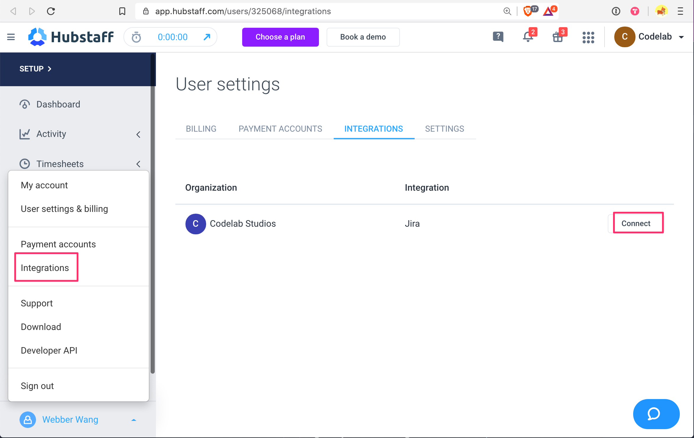

<!--- ### Data Modeling
Codelab is a software platform for building web applications.

- Create schema by defining models, fields, and the relationships between them (1-M, M-1 etc).

### Content Creation

- Create content by adding data to dynamically created schema.

You'll be helping out with developing features, the tech stack is available [here](/tech-stack) if you are curious what frameworks & libraries you'll be working with.
-->

## [Join The Team](#join-the-team){id="join-the-team"}

1. Accept invite to [Bitbucket](https://bitbucket.org/codelabstudios/codelab) for version control

2. Accept invite to [Jira](https://codelabstudios.atlassian.net) for task management

3. Accept invite to [Hubstaff](https://hubstaff.com) for time tracking

   - Install [Hubstaff Desktop Client ](https://app.hubstaff.com/download)

4. Connect Jira to your Hubstaff account

- In order to log time, you will need to select a Jira issue

## [Jira Overview](#issue-status){id="issue-status"}

As a Developer, you'll only be concerned with `To Do`, `WIP`, & `Done`. The others are for the Admin

- `Backlog` The issue is put on pause, could be assigned or un-assigned.
- `To Do` The issue is assigned & ready for action.
- `WIP` The issue is currently being worked on.
- `Done` The issue is completed & ready for review.
- `Resolved` The issue is approved & closed.

## [Issue Workflow](#workflow){id="workflow"}

<!-- Note that issues cannot be manually moved, they are triggered to move based on your commit messages. We will talk about commit message format after dealing with the workflow. -->

### `Backlog` -> `To Do`

Tasks that are in `To Do` are assigned to you. Follow the `Priority` field, but use your best judgement on which issue to work on first, in case there are blockers.

### `To Do` -> `WIP`

Once you have decided which issue to work on, create a branch off `develop` following the naming convention below:

- We use the [Gitflow Workflow](https://www.atlassian.com/git/tutorials/comparing-workflows/gitflow-workflow), clone off **develop** to **feature/\***, with pascal-case naming convention. **feature/my-new-feature**
- Name it something relevant to the feature
- Push this empty branch remotely in order to move the issue from `Backlog` to `To Do`

### `WIP` -> `Done`

When your code is ready to be reviewed, all you need to do is create a Pull Request to `develop`, and the issue will be automatically moved to `Done`.

## Commit Messages

We follow the [commitlint format](https://github.com/conventional-changelog/commitlint).

- type(scope?): CODE-# subject
- type is the default config including [build, ci, chore, docs, feat, fix, perf, refactor, revert, style, test]
- scope is our monorepo package names [api, common, core, ui, utils, etc]
- E.G. **feat(core,ui): CODE-23 #done add feature to core and ui package**
- E.G. **build(): CODE-16 #done improve TSC compiler options**
